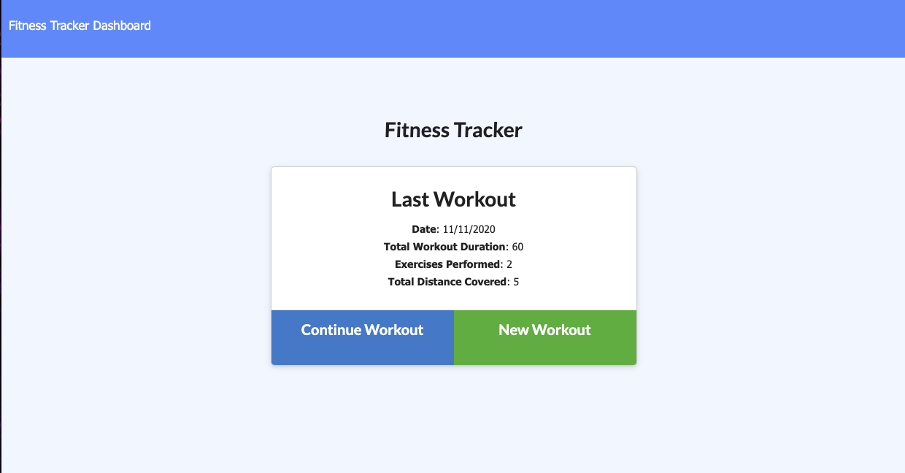

# Fitness Tracker
## Table of Contents
* [Description](#Description)
* [Installation Instruction](#Installation-Instructions)
* [Usage Information](#Usage-Information)
* [Contributions](#Contributions)
* [Testing](#Testing)
* [Questions?](#Questions?)
## Description
This application allows users to track their fitness. Log your workouts with relevant information, and the app, using mongo db, will save you workout info and allow you to view your progress in the dashboard.

## Installation Instructions
Download all the necessau files and run npm i in your Terminal/Gitbash.
## Usage Information
Follow the link to the deployed application. From there, a user can navigate between the home page, the dashbaord, and can also create and save workouts
## Contributions
Much thanks to Elijah Flanders for working on this project with me.
## Testing
N/A
## Questions?
Contact the author for further questions! 
Deployed link: (https://murmuring-refuge-23818.herokuapp.com/?id=5fac9160c7fbf200170bc522) 
Github link: (https://github.com/kyliemegan24) 
Email: kyliemegan24@gmail.com
